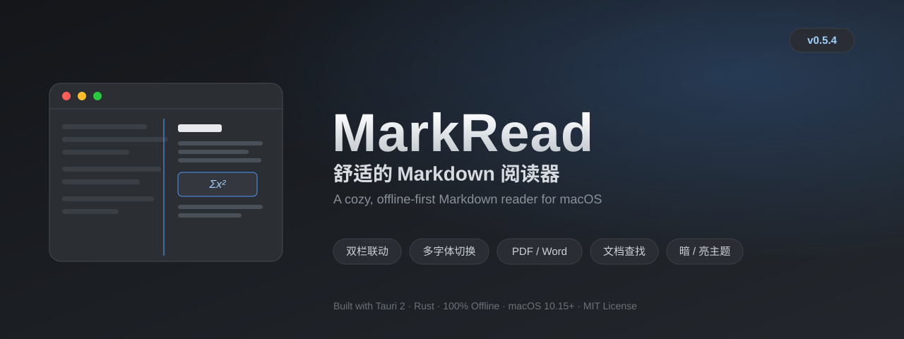
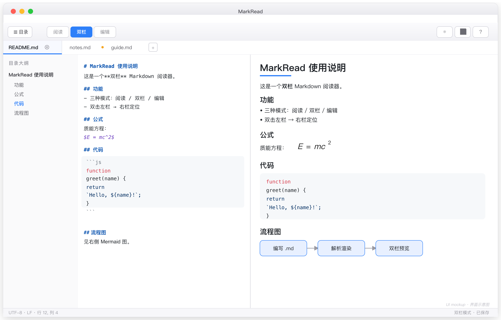

<p align="center">
  
</p>

# MarkRead

> 一个基于 Tauri 2 的轻量级 Markdown 阅读 / 编辑工具，主打「双栏联动定位」与「零依赖离线可用」。
> A lightweight Markdown reader/editor built on Tauri 2, featuring dual-pane click-to-locate and fully offline operation.

[English](#english) | [中文](#中文)

---

## 中文

### 简介
MarkRead 是一个用 Tauri 2（Rust + WebView）构建的桌面 Markdown 工具。它把「阅读、编辑、双栏预览」三种模式整合在一个窗口里，所有公式、代码高亮、字体与图标资源都**本地打包**，不依赖任何外网 CDN，断网也能用。

**当前版本：v0.5.4**

### 功能特性
- **三种模式**：阅读（纯预览）/ 双栏（左编辑右预览）/ 编辑（纯源码）。
- **自动保存 + 另存为**：编辑或双栏模式下输入约 1 秒后自动写回原文件；也可手动「另存为」另存副本。
- **「文件 ▾」菜单**：把 *保存 / 另存为 / 导出 PDF / 导出 Word / 切换主题* 收拢进工具栏最左侧的一个下拉按钮，点击展开选择，减少工具栏按钮；未保存修改时该按钮显示「脏点」高亮。
- **双栏双击关联定位**：
  - 左侧双击某行 → 右侧平滑滚动到对应段落并高亮。
  - 右侧双击正文 → 左侧编辑器把光标定位到对应源行。
  - 工具栏按钮（↦ 预览 / ↤ 编辑）与快捷键 `Cmd+Enter` 也可触发。
- **可拖拽分隔条**：双栏模式下拖动中间竖条自定义左右栏宽（自动记忆）。
- **暗 / 亮 / 纸张 三套主题**：一键切换，适配长时间阅读。
- **目录大纲**：`Cmd+\` 呼出侧边大纲，点击跳转。
- **数学公式与图表**：内置 KaTeX（LaTeX 公式）与 Mermaid（流程图 / 时序图等）。
- **自包含资源**：KaTeX 字体、代码高亮样式等都随包发布，无需联网。
- **多文档标签页**：通过右键 md「打开方式 → MarkRead」、拖入文件、或菜单「打开」，每个文件都会新开一个标签页；点击标签切换，标签上的 × 关闭。已打开的文件再次打开会自动聚焦到对应标签。每个标签独立记住阅读模式、目录展开、滚动位置与未保存状态。
- **多种正文字体**：内置 5 款 OFL 开源字体（思源黑体 Noto Sans SC / 思源宋体 Noto Serif SC / 马善政楷书 Ma Shan Zheng / Inter / JetBrains Mono），在「帮助」面板（问号按钮）的「显示设置」中可分别切换正文与代码字体，选择即时生效并保存在本机。
- **导出 PDF / Word**：通过「文件 ▾ ▸ 导出 PDF / 导出 Word」（快捷键 `Cmd+Shift+P` / `Cmd+Shift+W`）导出当前文档。两者均在本地离线完成：
  - **PDF**：用 html2pdf.js 在本地把当前渲染内容生成为真正的 `.pdf`（白底、完全离线、零外部服务）。
  - **Word**：把当前渲染后的 HTML 转换为**真正的 .docx**（标题层级、列表、表格、代码块、图片均尽量保留），通过保存对话框落盘。
- **文档内查找**：`Cmd/Ctrl+F` 或「文件 ▾」外的查找入口打开查找栏。阅读/分屏模式下高亮全部命中并支持上一个/下一个跳转（实时计数）；编辑模式下在源码中直接选中命中行。支持「区分大小写」。

### 界面预览


> 上图为 **UI 示意图**，展示双栏模式下的多文档标签页、左侧目录大纲与右侧渲染预览（含 KaTeX 公式、代码高亮、Mermaid 流程图）。实际界面以应用为准，可在 Mac 上截取真实窗口图替换本图（顶部 banner 为本项目自制 SVG，可直接替换 `assets/banner.svg`）。

### 快捷键
| 快捷键 | 功能 |
|---|---|
| `Cmd+O` | 打开文件 |
| `Cmd+S` | 保存 |
| `Cmd+Shift+S` | 另存为 |
| `Cmd+Shift+P` | 导出为 PDF |
| `Cmd+Shift+W` | 导出为 Word |
| `Cmd+\` | 目录大纲 |
| `Cmd+T` | 切换主题 |
| `Cmd+Enter` | 双栏关联定位（编辑器聚焦→跳预览，预览聚焦→跳编辑器） |
| `Cmd/Ctrl+F` | 文档内查找 |
| 双击左/右栏 | 左→右 / 右→左 关联定位 |

### 字体选择（开源字体）
在「帮助」面板（工具栏问号按钮）的「显示设置」中，可分别为**正文**与**代码**选择字体，改动即时生效，并保存在本机（localStorage），重启后保留：

- **正文字体**：系统默认（衬线）/ 思源黑体 / 思源宋体 / 马善政楷书 / Inter（西文）
- **代码字体**：系统默认 / JetBrains Mono

内置字体均为 **SIL OFL** 开源许可证，随应用离线打包，不依赖任何外网：

| 字体 | 风格 | 用途 | 许可证 |
|---|---|---|---|
| Noto Sans SC（思源黑体） | 无衬线黑体 | 正文 | SIL OFL |
| Noto Serif SC（思源宋体） | 衬线宋体 | 正文 | SIL OFL |
| Ma Shan Zheng（马善政楷书） | 手写楷书（文艺） | 正文 | SIL OFL |
| Inter | 现代无衬线（西文） | 正文 | SIL OFL |
| JetBrains Mono | 等宽编程字体 | 代码 | SIL OFL |

> 注：原方案的文艺中文选项为「霞鹜文楷 LXGW WenKai」，但它没有可用的 woff2 子集分发、官方仅有 TTF（体积过大），故改用同样 OFL 开源、且能稳定下载的「马善政楷书」。

### 导出 PDF 与 Word
通过工具栏最左侧的「文件 ▾」菜单，或菜单栏「文件 ▸ 导出为 PDF… / 导出为 Word…」（快捷键 `Cmd+Shift+P` / `Cmd+Shift+W`）即可导出**当前正在阅读的文档**。两者均在本地、离线完成，不调用任何外部服务：

- **PDF**：使用 html2pdf.js 把当前渲染内容在本地直接生成为真正的 `.pdf` 文件（白底以保证可读性，文字以图片形式栅格化，因此不可选中文本）。完全离线、零依赖，适合分享与归档。
- **Word**：在本地把当前渲染后的 HTML 转换为**真正的 .docx** 文件（标题层级、列表、表格、代码块、图片均尽量保留），通过保存对话框落盘。

> 导出的是当前预览内容；若处于纯编辑模式，导出时会先按最新源码渲染一次再导出。
> 若需要「可选中文字、完美版式」的矢量 PDF，可改走 macOS 原生打印（`NSPrintOperation`），那需要额外的原生代码与整体重编，欢迎提 Issue 讨论。

### 安装与构建（从源码）
前置条件：Node.js（含 npm）、Rust 工具链、以及 Tauri 2 所需的 macOS 构建依赖（Xcode Command Line Tools）。

```bash
git clone https://github.com/Rabbit101010/MarkRead.git
cd MarkRead
npm install
npm run tauri build
```

构建完成后，应用位于：

```
src-tauri/target/release/bundle/macos/MarkRead.app
```

把它拖到 `/Applications` 即可长期使用。

### 下载（预编译）
不想自己编译？前往 **[Releases](https://github.com/Rabbit101010/MarkRead/releases)** 下载对应平台的安装包：
- **macOS**（`.dmg`，Apple Silicon 与 Intel 通用，macOS 10.15+）：打开 `.dmg`，把 `MarkRead.app` 拖入「应用程序」。
- **Windows**（`.msi`，x64，Windows 10 / 11）：双击安装即可。

> 注：macOS 包未公证，首次打开若被拦截，右键 → 打开，或终端执行 `xattr -cr /Applications/MarkRead.app`；Windows 包未签名，安装时 SmartScreen 可能警告，选择「仍要运行」即可。

### 技术栈
Tauri 2 · Rust · markdown-it · KaTeX · Mermaid · highlight.js · html2pdf.js · 原生 WebView（macOS WKWebView / Windows WebView2）· 跨平台（macOS 10.15+ / Windows 10·11）

### 许可证
本项目采用 **MIT 许可证**。详见 [LICENSE](LICENSE) 文件。

---

## English

### Overview
MarkRead is a desktop Markdown tool built with Tauri 2 (Rust + WebView). It combines three modes — reading, editing, and split-pane preview — into a single window. All math rendering, code highlighting, fonts, and icons are **bundled locally**, with no external CDN dependency, so it works fully offline.

**Current version: v0.5.4**

### Features
- **Three modes**: Read (preview only) / Split (edit on the left, preview on the right) / Edit (source only).
- **Auto-save + Save As**: in Edit/Split mode, edits are written back to the original file after ~1s of inactivity; you can also "Save As" to a new file manually.
- **"File ▾" menu**: *Save / Save As / Export PDF / Export Word / Toggle theme* are collapsed into a single dropdown button at the far left of the toolbar — click to expand and choose, keeping the toolbar uncluttered. The button shows a "dirty" highlight when there are unsaved changes.
- **Dual-pane click-to-locate**:
  - Double-click a line on the left → the right pane smoothly scrolls to the matching block and highlights it.
  - Double-click body text on the right → the left editor moves the cursor to the corresponding source line.
  - Toolbar buttons (↦ Preview / ↤ Editor) and the `Cmd+Enter` shortcut do the same.
- **Resizable splitter**: drag the center divider in Split mode to adjust pane widths (remembered automatically).
- **Dark / Light / Sepia themes**: one-click toggle for comfortable reading.
- **Table of contents**: press `Cmd+\` to open the side outline and jump to any heading.
- **Math & diagrams**: built-in KaTeX (LaTeX) and Mermaid (flowcharts, sequence diagrams, etc.).
- **Self-contained assets**: KaTeX fonts and highlight styles ship with the app — no network needed.
- **Multiple-document tabs**: opening a file via "Open With → MarkRead" (right-click a .md), dropping files, or the "Open" menu each spawns a new tab. Click a tab to switch; the × closes it. Re-opening an already-open file focuses its tab instead of duplicating. Each tab independently remembers its mode, outline state, scroll position, and unsaved changes.
- **Multiple body fonts**: 5 bundled OFL open-source fonts (Noto Sans SC / Noto Serif SC / Ma Shan Zheng / Inter / JetBrains Mono). Switch body and code fonts live in the "Display settings" of the Help panel (the **?** button); your choice is saved locally.
- **Export PDF / Word**: via "File ▾ ▸ Export PDF / Export Word" (`Cmd+Shift+P` / `Cmd+Shift+W`). Both run fully on-device:
  - **PDF**: html2pdf.js renders the current content into a real `.pdf` locally (white background, fully offline, zero external service).
  - **Word**: converts the current rendered HTML into a **real .docx** (headings, lists, tables, code blocks, images preserved as much as possible), saved via the standard save dialog.
- **In-document find**: `Cmd/Ctrl+F` (or a find entry) opens a search bar. In read/split mode it highlights every match with prev/next navigation and a live count; in edit mode it selects matches directly in the Markdown source. A "match case" toggle is included.

### Screenshots


> The image above is a **UI mockup** showing the split-pane mode with multiple-document tabs, the left-side outline, and the rendered preview (KaTeX, syntax highlighting, Mermaid). The real UI may differ — feel free to replace it with an actual window screenshot. (The top banner is a hand-made SVG in this repo; edit `assets/banner.svg` directly.)

### Keyboard Shortcuts
| Shortcut | Action |
|---|---|
| `Cmd+O` | Open file |
| `Cmd+S` | Save |
| `Cmd+Shift+S` | Save As |
| `Cmd+Shift+P` | Export as PDF |
| `Cmd+Shift+W` | Export as Word |
| `Cmd+\` | Table of contents |
| `Cmd+T` | Toggle theme |
| `Cmd+Enter` | Dual-pane locate (editor focus → jump preview; preview focus → jump editor) |
| `Cmd/Ctrl+F` | Find in document (highlight all matches, jump prev/next) |
| Double-click left/right pane | Locate left→right / right→left |

### Font selection (open-source)
In the Help panel (the **?** button in the toolbar), the "Display settings" let you pick separate fonts for **body** and **code**. Changes apply instantly and persist locally (localStorage), surviving restarts:

- **Body font**: System default (serif) / Noto Sans SC / Noto Serif SC / Ma Shan Zheng / Inter (Latin)
- **Code font**: System default / JetBrains Mono

All bundled fonts are released under the **SIL Open Font License (OFL)** and ship offline with the app — no network needed:

| Font | Style | Use | License |
|---|---|---|---|
| Noto Sans SC | Sans-serif | Body | SIL OFL |
| Noto Serif SC | Serif | Body | SIL OFL |
| Ma Shan Zheng | Handwritten script (artistic) | Body | SIL OFL |
| Inter | Modern sans-serif (Latin) | Body | SIL OFL |
| JetBrains Mono | Monospaced | Code | SIL OFL |

> Note: the artistic Chinese option was originally planned as "LXGW WenKai", but it has no woff2 subset distribution (only large TTFs available), so we substituted "Ma Shan Zheng" — also OFL-licensed and reliably downloadable.

### Export PDF & Word
Use the "File ▾" menu at the far left of the toolbar, or "File ▸ Export as PDF… / Export as Word…" (`Cmd+Shift+P` / `Cmd+Shift+W`) to export the **document you are currently reading**. Both run locally and offline, with no external service:

- **PDF**: html2pdf.js renders the current content into a real `.pdf` file on-device (white background for readability; text is rasterized as an image, so it is not selectable). Fully offline and dependency-free — ideal for sharing or archiving.
- **Word**: converts the current rendered HTML into a **real .docx** entirely on-device (offline). Headings, lists, tables, code blocks, and images are preserved as much as possible, then saved via the standard save dialog.

> Export uses the current preview. In pure-edit mode it renders the latest source once before exporting.
> For a "selectable-text, pixel-perfect" vector PDF, a macOS-native print path (`NSPrintOperation`) would be needed — extra native code and a full rebuild. Open an Issue if you want this.

### Install & Build (from source)
Prerequisites: Node.js (with npm), the Rust toolchain, and the macOS build dependencies required by Tauri 2 (Xcode Command Line Tools).

```bash
git clone https://github.com/Rabbit101010/MarkRead.git
cd MarkRead
npm install
npm run tauri build
```

After the build, the app is at:

```
src-tauri/target/release/bundle/macos/MarkRead.app
```

Drag it to `/Applications` for permanent use.

### Download (prebuilt)
Prefer not to build? Grab the installer for your platform from the **[Releases](https://github.com/Rabbit101010/MarkRead/releases)** page:
- **macOS**（`.dmg`, universal for Apple Silicon **and** Intel, macOS 10.15+): open the `.dmg` and drag `MarkRead.app` into Applications.
- **Windows**（`.msi`, x64, Windows 10 / 11): double-click to install.

> Note: the macOS build is not notarized — if first launch is blocked, right-click → Open, or run `xattr -cr /Applications/MarkRead.app` in Terminal. The Windows build is unsigned, so SmartScreen may warn; choose "Run anyway".

### Tech Stack
Tauri 2 · Rust · markdown-it · KaTeX · Mermaid · highlight.js · html2pdf.js · native WebView (macOS WKWebView / Windows WebView2) · cross-platform (macOS 10.15+ / Windows 10·11)

### License
This project is licensed under the **MIT License**. See the [LICENSE](LICENSE) file for details.
