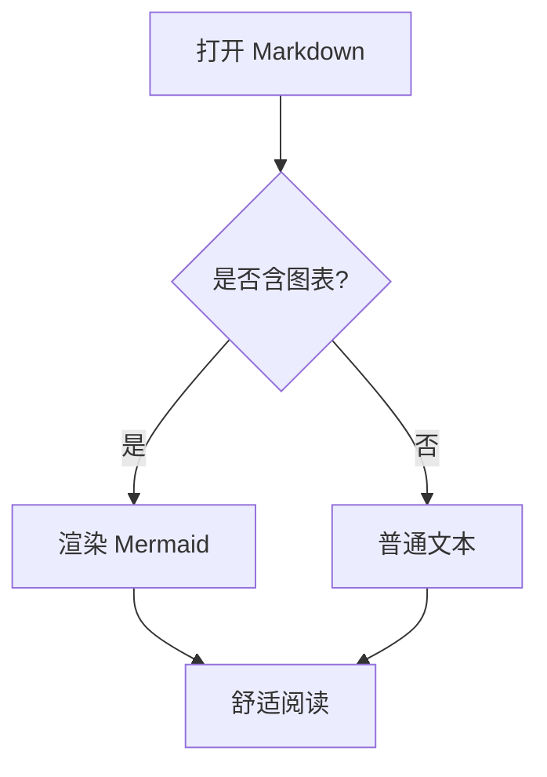
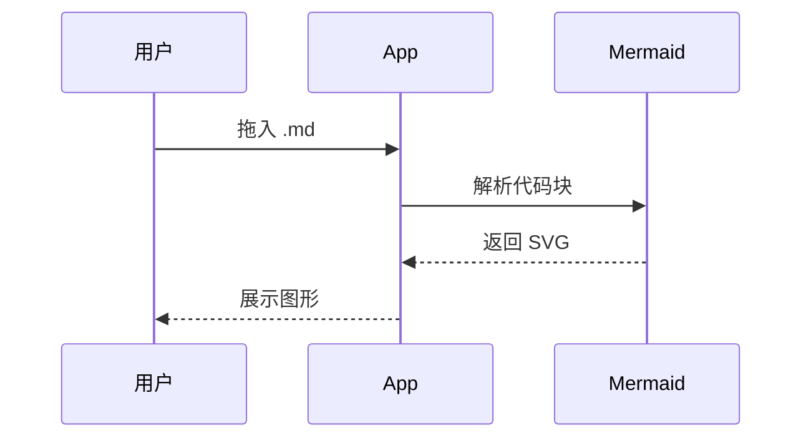
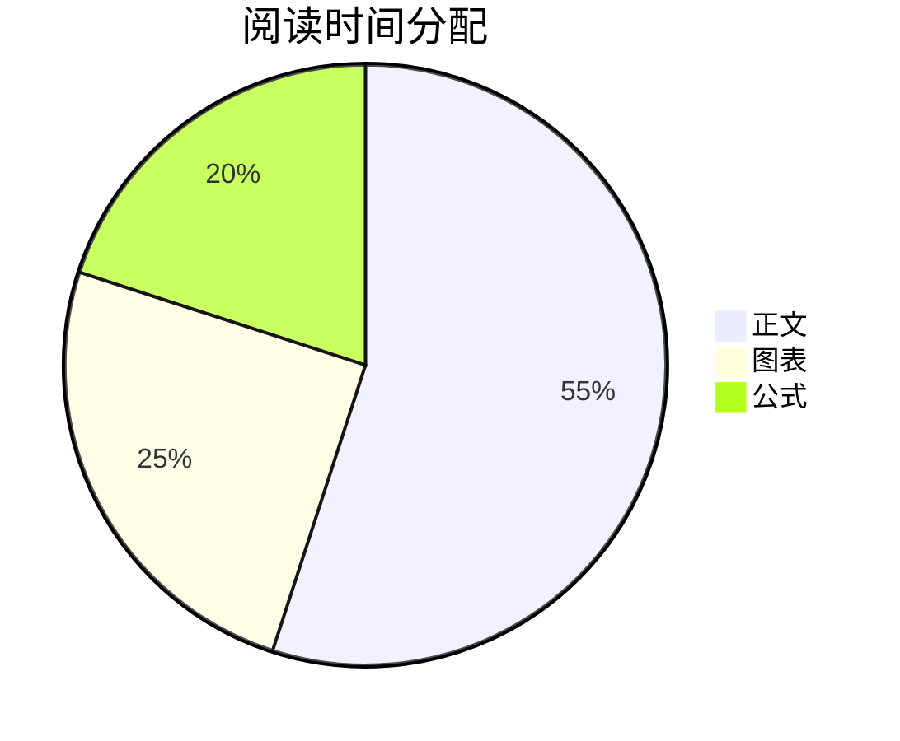

# MarkRead 功能演示

这是一个用于验证 **MarkRead** 渲染能力的示例文档。它覆盖文字排版、代码高亮、Mermaid 图表与 KaTeX 数学公式。

## 1. 文字与排版

普通段落支持 **加粗**、*斜体*、~~删除线~~，以及[超链接](https://example.com)。引用如下：

> 阅读应当是一件舒服的事：合适的行宽、字号与留白，比花哨更重要。

有序与无序列表：

1. 打开文件（拖入或 Cmd+O）
2. 切换主题（Cmd+T）
3. 调节字号（Cmd + / − / 0）

- 浅色 / 护眼 / 深色
- 目录大纲
- 导出 PDF

## 2. 表格

| 功能 | 快捷键 | 说明 |
| --- | --- | --- |
| 打开 | Cmd+O | 文件对话框 |
| 主题 | Cmd+T | 循环切换 |
| 目录 | Cmd+\ | 侧边大纲 |
| 导出 | Cmd+P | 保存为 PDF |

## 3. 代码高亮

```javascript
function fib(n) {
  let [a, b] = [0, 1];
  for (let i = 0; i < n; i++) [a, b] = [b, a + b];
  return a;
}
console.log(fib(10)); // 55
```

```python
def greet(name: str) -> str:
    return f"Hello, {name}!"
```

## 4. Mermaid 图表

流程图：



时序图：



饼图：



## 5. 数学公式

行内公式例如质能方程 $E = mc^2$，以及欧拉恒等式 $e^{i\pi} + 1 = 0$。

块级公式：

$$
\int_{-\infty}^{\infty} e^{-x^2}\,dx = \sqrt{\pi}
$$

二次方程求根公式：

$$
x = \frac{-b \pm \sqrt{b^2 - 4ac}}{2a}
$$

## 6. 结语

把光标停在目录上可快速跳转；切换深色主题后图表会自动重新着色。祝阅读愉快。
